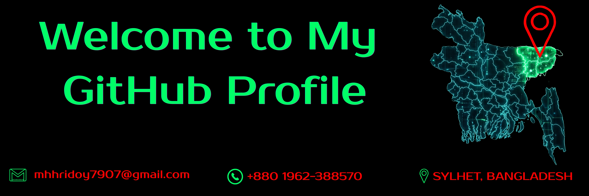

[](https://git.io/typing-svg)

<div align="center">
  
</div>

---

## 🎯 About Me

I'm a passionate **Full-Stack Developer** and **AI Enthusiast** with over 2 years of hands-on programming experience. I specialize in building intelligent web applications, automation tools, and exploring the frontiers of artificial intelligence. Always eager to learn, innovate, and contribute to the tech community.

<div align="center">
  
  **Currently pursuing:** BSc in Computer Science & Engineering  
  **Based in:** Sylhet, Bangladesh  
  **Open to:** Collaboration, freelance projects, and learning opportunities
  
</div>

---

## 🛠️ Tech Stack & Tools

<div align="center">

### Core Programming Languages


### Databases & Backend


### Development Tools


### Frameworks & Platforms


### Specializations


</div>

---

## 📊 GitHub Statistics

<div align="center">

[](https://github.com/mhhridoy7907)

[](https://github.com/mhhridoy7907)

</div>

---

## 🎓 Education & Certifications

### 🏫 Academic Background

| Degree | Institute | Year | Status |
|--------|-----------|------|--------|
| **BSc in CSE** | RTM Al-Kabir Technical University | 2026–Present | 🔄 Ongoing |
| **HSC** | Universal College, Sylhet | 2023 | ✅ Completed |
| **SSC** | The Aided High School, Sylhet | 2021 | ✅ Completed |

### 📜 Professional Certifications

| Certification | Provider | Year | Duration |
|---------------|----------|------|----------|
| **ICT & Basic Application** | Department of Youth Development | 2025 | 6 Months |
| **SEO, Personal Branding & Prompt Engineering** | Times IT | 2024 | 6 Months |
| **Digital Marketing** | The IT Aid | 2023 | 6 Months |
| **Office Application** | Skill Development Training Center | 2022 | 6 Months |

### 🏅 Industry Certifications

<div align="center">
  
  
</div>

<div align="center">
  
  
</div>

<div align="center">
  
  
</div>

### 💼 Work Experience

<div align="center">
  
</div>

---

## 💡 Skills & Competencies

### IT Skills
- **Web Development:** HTML5, CSS3, JavaScript, PHP, SQL, REST APIs
- **Mobile Development:** Flutter, Android Studio
- **AI & Automation:** Prompt Engineering, AI Assistant Development, Task Automation
- **Cybersecurity:** Ethical Hacking, Basic Cyber Security
- **Digital Marketing:** SEO Optimization, Personal Branding
- **Office & Productivity:** Microsoft Office Suite (Word, Excel, PowerPoint)
- **IoT & Hardware:** Arduino, ESP32 Programming

### Soft Skills
✨ **Communication:** Strong presentation and interpersonal abilities  
⏱️ **Time Management:** Consistent deadline adherence  
🤝 **Teamwork:** Excellent collaborative project experience  
🧠 **Problem-Solving:** Analytical thinking and creative solutions  
📚 **Learning Mindset:** Continuous self-improvement and adaptation

---

## 🚀 Featured Projects

<div align="center">

| Project | Description | Status |
|---------|-------------|--------|
| 🤖 **AI Virtual GF** | Romantic conversational AI with memory, personality & Bangla voice | Live |
| 🛠️ **Modern Web Tools** | Interactive web apps & cutting-edge UI experiments | Live |
| ⚡ **AI Utilities** | Productivity tools powered by artificial intelligence | Live |
| 📱 **WhatsApp Inbox Viewer** | Clean interface for viewing exported WhatsApp conversations | Live |
| 🛰️ **ESP32 Radar System** | Hardware radar simulation using ESP32 microcontroller | Live |
| 🌐 **Web Fun & Games** | Mini games and engaging interactive projects | Live |
| 🔧 **Automation Scripts** | Task automation and workflow optimization tools | Live |
| 🎨 **Design Experiments** | Creative frontend UI explorations and prototypes | Live |
| 💻 **Tech Experiments** | Learning projects and innovative prototypes | Live |

</div>

<p align="center">
  📂 Explore more: <a href="https://github.com/mhhridoy7907?tab=repositories">GitHub Repositories</a>
</p>

---

## 🌐 Connect With Me

<div align="center">

### 📞 Direct Contact
[](https://wa.me/8801962388570)
[](mailto:mhhridoy7907@gmail.com)

### 🌍 Social & Professional
[](https://www.youtube.com/@mh2_hridoy)
[](https://www.hackerrank.com/profile/mhhridoy7907)
[](https://bsky.app/profile/mhhridoy7907.bsky.social)
[](https://www.facebook.com/mh.hridoy.567130)

<br>

**Let's collaborate and build something amazing together!** 🚀

</div>

---

<div align="center">
  
  
  
  ⭐️ **If you found this profile helpful, please consider giving it a star!**
  
  ```
  Made with ❤️ by Murad Hasan Hridoy
  ```
  
</div>
